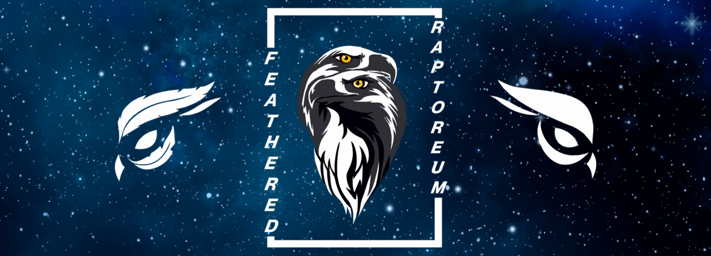

We have huge aspirations to take the next important steps needed for the growth of Raptoreum into the new cycles and beyond, and one of those steps is incorporation.

## Feathered corp

Feathered Corp was created by the RTM Core Team members Paul Mills (aka Binarai) and David Morris (BigPiggy01), and was needed in order to move forward with progressing major Raptoreum partnerships.

<!--truncate-->

Some of the largest exchanges in the world required the Raptoreum project to have a permanent base. After months of research on location, Seychelles was chosen for being free from stifling regulations that hinder and hamper innovation without any tradition of regulatory overreach. The tax status of an IBC registered in Seychelles also provides an unfettered environment in which we can grow the project as well and handle any potential Intellectual Property issues that may or may not arise.

Now that this is in place, we are excited to be able to do things and make connections like we never have before. We called it *‘Feathered’* as this allows us to stretch our wings into multiple areas of growth, allowing interconnections within the Raptoreum project under one umbrella. In a time of uncertainty, larger players in the field are looking for trust in a team and accountability to support their own projects, due to the lessons learnt from a historically bad previous financial cycle and the detrimental executive choices of some select coins.

## The future of Raptoreum

With our upcoming code releases and projects already building on our blockchain, it is important that nothing holds us back from realizing our goals in providing a full suite of tools for the worlds community of developers. Clearing the road legally for a bump in market cap standings is one of those goals, with all the juicy bits as fruits of our labour.

Raptoreum is deep in our hearts and we have always done everything by the book. We never have **and never will** cut a single corner to achieve short term success. We believe in the long term sustainability, where the true value of work conducted by the team and the community shines in a real, organic way. Even in the darkest days of a bear market, our communities have shown to be some of the busiest in the world; We think that is a testament of whats to come!

It is a pleasure to bring this great news to you all. LONG LIVE RAPTOREUM!

*HUGE thanks to Zlata Amaranth for the awesome branding and artwork.*

Thank you \- The Raptoreum Team
