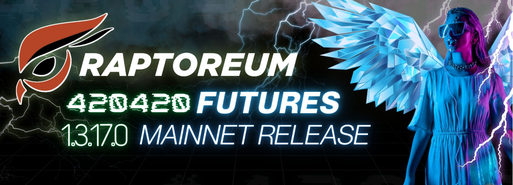

## We did it, Marty!

After some **HUGE** development from the team, Raptoreum Futures Mainnet code had been released with RaptoreumCore version 1.3.17.0. Raptoreum Futures intend to be the first major foundation which will allow our eventual Smart Contracts, Assets and Blockchain to be one of the most advanced in the world.

**Download it here:** [Release 1.13.17.0][dl-wallet] (GitHub)

:::important Important

**Update your wallet before block 420420!**

:::

<!--truncate-->

## Changes, Fixes, and Features

Updates include numerous RPC changes as well as backports form BTC 17 and 18 as well as updates and upgrades to most of the Dash features!
From block 420420, RTM “futures” will bring changes to changes to the following **RPC functions**:

### `createrawtransaction`

with additional fields being available for the addition of block based or time based lock times.

### `sendtoaddress`

with additional fields being available for the addition of block based or time based lock times.

Additionally, the following changes have been made to the RaptoreumCore code

- The Fee Setting spork has been added, to prevent any future "gas crisis" situations.
- RaptoreumCore bootstrapping using POW cache has been implemented, reducing wallet sync times significantly. POW cache packages can be found on the [Raptoreum Bootstrap Packages][bootstraps] archive.
- Various visual bug fixes on the QT Wallet
- Optimizations for wallets with large amounts of transactions
- Significantly more efficient threaded workload handling

Apart from the above mentioned RTM changes, this update brings a plethora of changes over from the original Dash code. The full details on the Dash release can be found [here (Dash Core 0.17.0.2)][gh-dash-update].

## Important Notes

Dual checksums for reach release are packaged with the zip-archives for each operating system respectively. Remember to check both checksums. There have been reports of prior instances of malware in some wallet's files modified to meet single file checksum verifications.

:::danger Avoid negative lock times

Avoid setting both *lock times* as negative to prevent indefinitely locking your assets. More info available on the [futures docs][docs-futures] soon.

:::

Thank you \- The Raptoreum Team

[dl-wallet]: https://github.com/Raptor3um/raptoreum/releases/tag/1.13.17.0
[docs-futures]: docs/raptoreum/futures
[gh-dash-update]: https://github.com/dashpay/dash/blob/v0.17.0.2/doc/release-notes.md
[bootstraps]: https://bootstrap.raptoreum.com